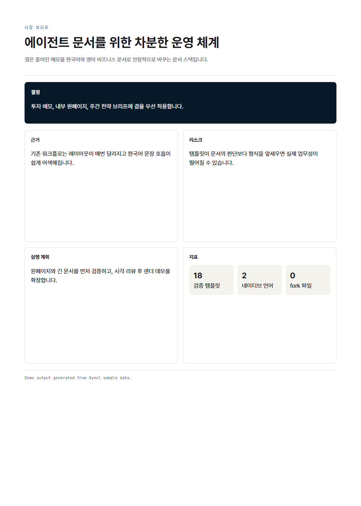
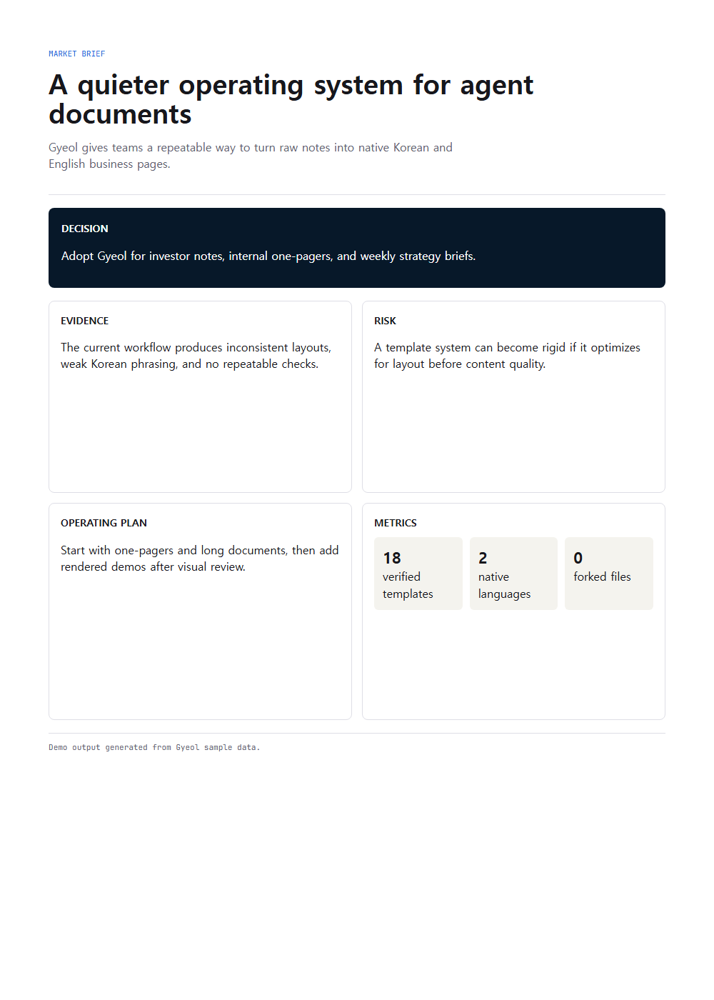
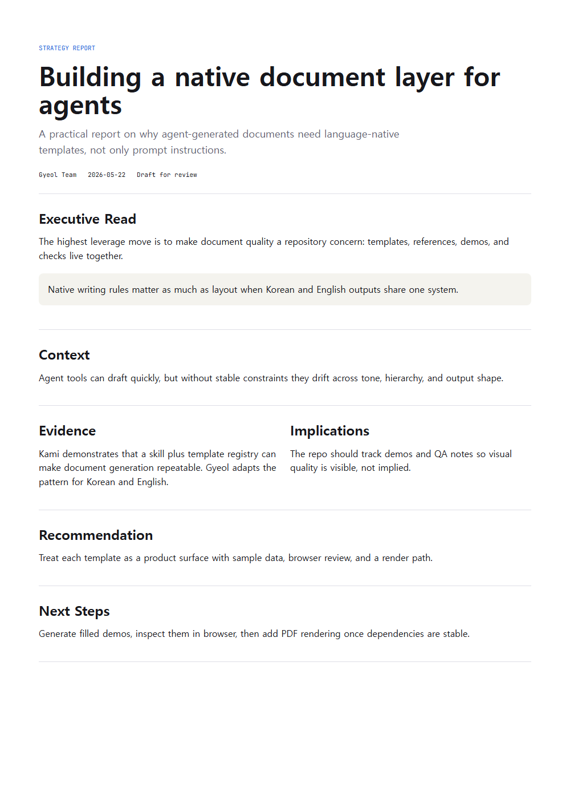
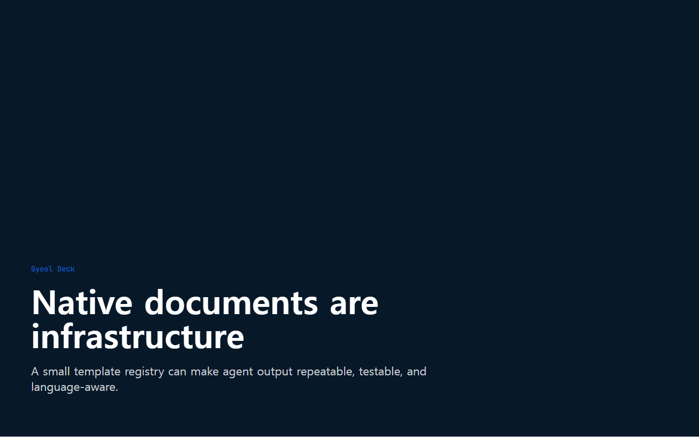
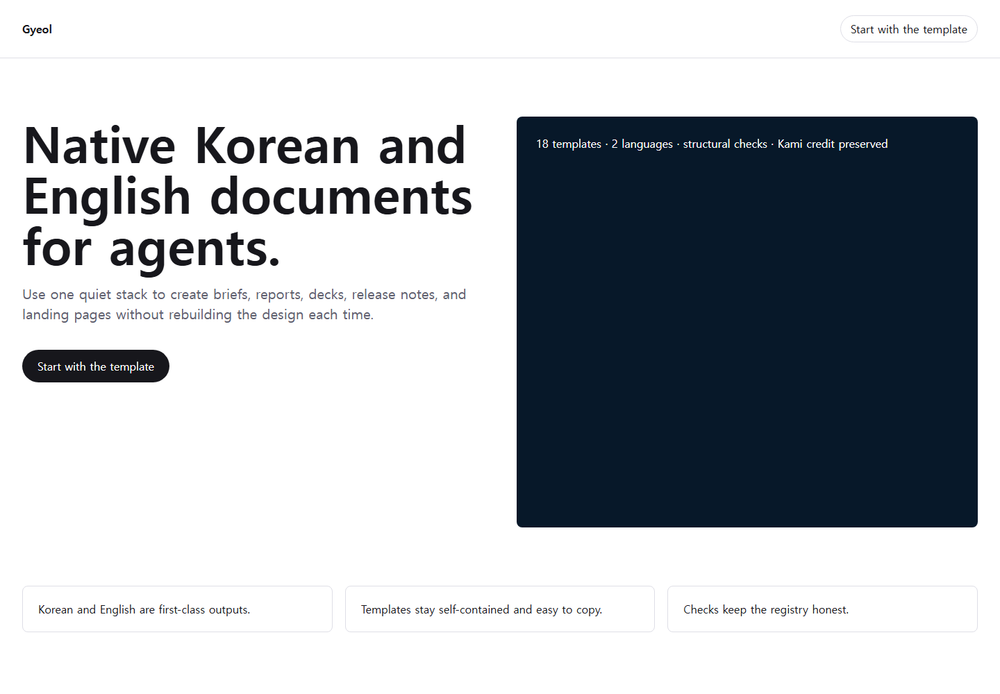

# Gyeol / 결

<div align="center">
  <h3>Native Korean and English business documents for agents.</h3>
  <p><b>Write Korean as Korean. Write English as English. Ship both from one verified document stack.</b></p>
  <a href="LICENSE"></a>
  <a href="https://github.com/JangHyun-bin/GyeoL"></a>
</div>

## 한국어

Gyeol은 Codex, Claude Code, Claude Desktop, 그리고 로컬 스킬 폴더를 읽는 에이전트가 한국어와 영어 비즈니스 문서를 바로 만들 수 있게 해주는 문서 스킬, 템플릿, 검증 저장소입니다.

한국어는 영어 번역문이 아니라 처음부터 한국어 문서로 씁니다. 영어도 별도 네이티브 출력으로 다룹니다. Gyeol은 [Kami](https://github.com/tw93/Kami)의 저장소 구조, 템플릿 중심 사고, 검증 루프에서 영향 받았습니다.

### 결과 보기

| 한국어 원페이저 | English One-Pager | English Long Doc |
|---|---|---|
| [](assets/demos/demo-one-pager-ko.html) | [](assets/demos/demo-one-pager.html) | [](assets/demos/demo-long-doc.html) |

| Slides | Landing Page |
|---|---|
| [](assets/demos/demo-slides.html) | [](assets/demos/demo-landing-page.html) |

전체 샘플은 `assets/demos/demo-*.html`에 있고, 브라우저/렌더 기준 QA 기록은 `docs/design-qa/2026-05-22-render-qa.md`에 있습니다.

### 바로 설치

`npx`는 편의 경로입니다. 직접 clone해서 스킬 폴더에 넣어도 됩니다.

**Codex, OpenCode, Pi 등 generic agents**

```bash
npx skills add JangHyun-bin/GyeoL -a '*' -g -y
```

**Claude Code**

```bash
npx skills add JangHyun-bin/GyeoL -a claude-code -g -y
```

**직접 clone해서 확인**

```bash
git clone https://github.com/JangHyun-bin/GyeoL.git
cd GyeoL
python scripts/package_skill.py
python scripts/tests/test_build.py
python scripts/build.py --check
```

**Claude Desktop**

`dist/gyeol.zip`을 Claude Desktop의 Customize > Skills > "+" > Create skill에서 업로드합니다. ZIP은 `python scripts/package_skill.py`로 다시 만들 수 있습니다.

자세한 설치와 문제 해결은 [docs/onboarding.md](docs/onboarding.md)를 보세요. 빠른 사용 표는 [CHEATSHEET.md](CHEATSHEET.md)에 있습니다.

### 프롬프트 예시

- `Gyeol로 한국어 투자자용 원페이저를 만들어줘.`
- `Gyeol로 이 리서치를 영어 장문 보고서로 정리해줘.`
- `Gyeol로 한국어 이력서를 만들어줘.`
- `Gyeol로 제품 출시용 랜딩 페이지를 만들어줘.`
- `Use Gyeol to create a Korean equity report from these notes.`
- `Use Gyeol to build a bilingual strategy deck.`

### 브랜드 프로필

반복해서 쓰는 이름, 회사, 톤, 언어 기본값, 브랜드 컬러는 `~/.config/gyeol/brand.md`에 저장할 수 있습니다.

```bash
mkdir -p ~/.config/gyeol
cp references/brand.example.md ~/.config/gyeol/brand.md
```

브랜드 프로필은 현재 요청을 덮어쓰지 않습니다. 명시 요청, 문서 판단, 세션 자료가 우선이고 프로필은 애매한 빈칸만 채웁니다. 자세한 규칙은 `references/brand-profile.md`, 예시는 `references/brand.example.md`를 보세요.

### 검증된 템플릿

현재 9개 유형을 한국어/영어로 검증합니다.

- `one-pager` / `one-pager-ko`
- `long-doc` / `long-doc-ko`
- `letter` / `letter-ko`
- `portfolio` / `portfolio-ko`
- `resume` / `resume-ko`
- `slides` / `slides-ko`
- `equity-report` / `equity-report-ko`
- `changelog` / `changelog-ko`
- `landing-page` / `landing-page-ko`

### 디자인 규칙

| 항목 | 규칙 |
|---|---|
| 언어 | 한국어와 영어를 동급 네이티브 산출물로 취급합니다. |
| 타이포그래피 | 산세리프 중심, 긴 본문은 촘촘하되 읽을 수 있는 행간을 유지합니다. |
| 색 | 절제된 기업 문서 팔레트, 검증된 토큰은 `references/tokens.json`을 따릅니다. |
| 밀도 | 문서 템플릿은 프린트 친화적으로, 랜딩 페이지는 화면 우선으로 작성합니다. |
| 톤 | 과장보다 구조, 수식어보다 데이터, 번역투보다 자연스러운 문장을 우선합니다. |
| 검증 | 등록된 템플릿과 `python scripts/build.py --check`를 통과한 산출물만 검증 범위로 말합니다. |

`Apply the Gyeol design system from github.com/JangHyun-bin/GyeoL/tree/main/references`처럼 외부 렌더러나 디자인 도구에 reference 폴더를 넘겨도 같은 기준을 적용할 수 있습니다.

### 검증 명령

```bash
python scripts/package_skill.py
python scripts/tests/test_build.py
python scripts/build.py --check
```

PDF 렌더링은 의도적으로 별도 경계입니다. PDF를 최종 산출물로 낼 때는 WeasyPrint와 PyPDF를 설치한 뒤 렌더 검증을 추가로 돌립니다.

### 출처

Gyeol은 Kami의 문서 스킬 구조와 검증 관점에서 영향을 받았기 때문에 명시적으로 출처를 남깁니다. 자세한 내용은 `CREDITS.md`, `NOTICE`, `references/kami.md`를 보세요.

## English

Gyeol is a document skill, template, and verification repository for agents that need native Korean and English business deliverables.

It is not a SaaS product. It is designed for Codex, Claude Code, Claude Desktop, and other tools that can read a skill from `~/.agents/` or a local checkout. Korean is treated as a native document language, not as an English translation. English outputs are native siblings.

Gyeol is structurally informed by [Kami](https://github.com/tw93/Kami): the repository shape, template-first workflow, and verification loop. The writing rules, visual system, and Korean/English template stack are rewritten for Gyeol.

### See It

| Korean One-Pager | English One-Pager | English Long Doc |
|---|---|---|
| [](assets/demos/demo-one-pager-ko.html) | [](assets/demos/demo-one-pager.html) | [](assets/demos/demo-long-doc.html) |

| Slides | Landing Page |
|---|---|
| [](assets/demos/demo-slides.html) | [](assets/demos/demo-landing-page.html) |

All sample outputs live in `assets/demos/demo-*.html`. Browser and render QA notes live in `docs/design-qa/2026-05-22-render-qa.md`.

### Quick Start

`npx` is a convenience path, not a requirement. You can also clone the repository directly into a skill directory.

**Codex, OpenCode, Pi, and generic agents**

```bash
npx skills add JangHyun-bin/GyeoL -a '*' -g -y
```

**Claude Code**

```bash
npx skills add JangHyun-bin/GyeoL -a claude-code -g -y
```

**Local checkout**

```bash
git clone https://github.com/JangHyun-bin/GyeoL.git
cd GyeoL
python scripts/package_skill.py
python scripts/tests/test_build.py
python scripts/build.py --check
```

**Claude Desktop**

Upload `dist/gyeol.zip` through Customize > Skills > "+" > Create skill. Rebuild the ZIP with `python scripts/package_skill.py`.

See [docs/onboarding.md](docs/onboarding.md) for detailed setup, verification, and troubleshooting. See [CHEATSHEET.md](CHEATSHEET.md) for a compact operator reference.

### Example Prompts

- `Use Gyeol to make a Korean one-pager for this product brief.`
- `Use Gyeol to turn this research into an English long document.`
- `Use Gyeol to create a Korean equity report from these notes.`
- `Use Gyeol to build a bilingual strategy deck.`
- `Gyeol로 한국어 이력서를 만들어줘.`
- `Gyeol로 제품 출시용 랜딩 페이지를 만들어줘.`

### Brand Profile

Store recurring identity, company, tone, language defaults, and brand color in `~/.config/gyeol/brand.md`.

```bash
mkdir -p ~/.config/gyeol
cp references/brand.example.md ~/.config/gyeol/brand.md
```

The brand profile never overrides the current request. Explicit prompts, document judgment, and supplied source material come first. The profile only fills ambiguous gaps. See `references/brand-profile.md` for the application rules and `references/brand.example.md` for a full template.

### Verified Templates

Gyeol currently verifies the full 9-type Korean/English stack:

- `one-pager` / `one-pager-ko`
- `long-doc` / `long-doc-ko`
- `letter` / `letter-ko`
- `portfolio` / `portfolio-ko`
- `resume` / `resume-ko`
- `slides` / `slides-ko`
- `equity-report` / `equity-report-ko`
- `changelog` / `changelog-ko`
- `landing-page` / `landing-page-ko`

### Design Rules

| Element | Rule |
|---|---|
| Language | Treat Korean and English as sibling native outputs. |
| Typography | Sans-first, dense enough for business documents, never cramped. |
| Color | Restrained enterprise palette; verified tokens live in `references/tokens.json`. |
| Density | Documents are print-friendly; landing pages are screen-first. |
| Voice | Prefer structure over hype, data over adjectives, and native phrasing over translation tone. |
| Verification | Only claim registered templates and checks that pass `python scripts/build.py --check`. |

You can hand the same design constraints to another renderer with: `Apply the Gyeol design system from github.com/JangHyun-bin/GyeoL/tree/main/references`.

### Verify

```bash
python scripts/package_skill.py
python scripts/tests/test_build.py
python scripts/build.py --check
```

Render verification is intentionally separate. Install WeasyPrint and PyPDF before treating PDF output as fully verified.

### Attribution

Gyeol keeps strong attribution to Kami because its repository shape and verification mindset are informed by Kami. See `CREDITS.md`, `NOTICE`, and `references/kami.md`.
